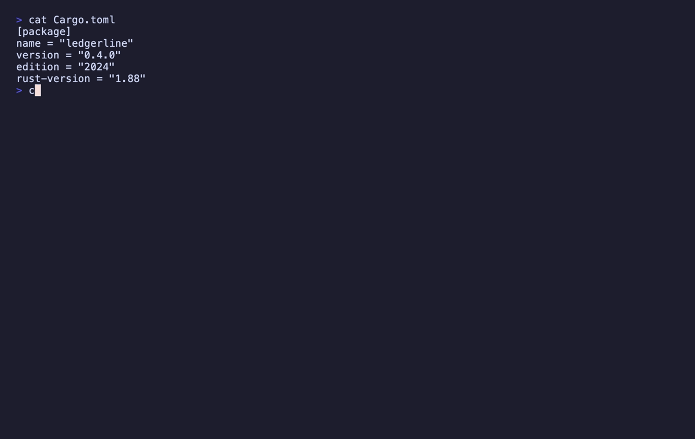

<h1 align="center">versions-le</h1>

<p align="center">
  <b>Find where the same dependency is constrained differently across a repository's manifests</b><br/>
  <i>and refuse, loudly, on any grammar it cannot model</i>
</p>

<p align="center">
  
  
</p>

---

<p align="center">
  
</p>

## What it does

One question, asked across every manifest in a tree rather than one file
at a time: **do these manifests agree about what version of anything this
repository depends on?**

The build broke because `crates/api` asks for `serde = "1.0.200"` and
`crates/web` asks for `serde = "2"`. Or it did not break, and will: CI
has run on `1.80` since March while `rust-version` says `1.88`.

```bash
versions-le .
```

```
error cargo: regex ("1" (api/Cargo.toml) and "2" (web/Cargo.toml) cannot both be satisfied by one version) [api/Cargo.toml, web/Cargo.toml]
warning cargo: serde (constrained 2 different ways across 2 files: 1, 1.0.200) [api/Cargo.toml, web/Cargo.toml]
warning ci: rust (CI builds on 1.80.0, below the declared minimum 1.88.0 in api/Cargo.toml) [.github/workflows/ci.yml, api/Cargo.toml]
info npm: left-pad (a dist tag resolves to whatever is newest at install time) [package.json]
refused ambiguous_version_string node: not evidently a version; excluded from comparison [.github/workflows/ci.yml]
refused cross_ecosystem regex: appears in cargo and npm; different ecosystems name different things, so these were not compared [api/Cargo.toml, package.json]
refused unknown_grammar left-pad: a dist tag is a moving target, not a version range; excluded from comparison [package.json]
refused unknown_grammar shared: an inherited workspace dependency carries its version elsewhere; excluded from comparison [web/Cargo.toml]
4 findings across 4 manifests — 1 error, 2 warning, 1 info
```

Exit code 1. The build stops before the deploy does.

That is stderr — the human half. stdout carries one JSON report for the
whole run, and **there is no `--json` flag**: one mode, nothing to
misremember, and the human summary is a projection of the same report so
the two cannot drift.

## The exit code is the product

| Code | Means |
|---|---|
| **0** | Nothing above `info`. Also 0 when there are **no manifests at all** — nothing can be in conflict with nothing, and failing a build over that would be the tool inventing a problem. |
| **1** | Findings. |
| **2** | The question was malformed — an unknown flag, an unknown ecosystem, a path that does not exist — or `--strict` and part of the tree went unanalysed. |

One unreadable manifest in fifty is **not** exit 2. It is named on stderr,
carried in the report's `diagnostics`, and the manifests that did parse
still answer.

## Install

```bash
cargo install versions-le
```

Or build it from source:

```bash
git clone https://github.com/nolindnaidoo/versions-le
cd versions-le/crate
cargo build --release      # ./target/release/versions-le
```

```bash
cargo install --path crate # or put it on your PATH
```

Needs **Rust 1.88+**, and nothing else. No runtime, no network, nothing
written.

## The six checks

| Code | Severity | What it means |
|---|---|---|
| `disjoint-constraint` | error | Two constraints for one dependency that **no single version satisfies**. The strongest claim this tool makes. |
| `malformed-constraint` | error | Shaped like a constraint of its own ecosystem, and broken. |
| `constraint-conflict` | warning | One dependency, two or more **different requirements** across sites. |
| `msrv-mismatch` | warning | `rust-version` differs across manifests, or a CI toolchain pin is below the declared minimum. |
| `prerelease-in-production` | warning | An `-rc` or `-alpha` constraint outside dev or build dependencies. |
| `floating-pin` | info | `latest`, `*`, a caret on a `0.x` version, or an unpinned CI tool version. |

**Different and unsatisfiable are two findings.** `constraint-conflict`
is a smell; `disjoint-constraint` is a build that cannot resolve. They
are never conflated.

Disjointness is decided by **interval arithmetic** over the modelled
ranges, not by string comparison — which is also why `>=20` and
`>=20.0.0` are not reported as a conflict. They are one requirement typed
twice.

**One finding per drifted dependency**, carrying every site. A dependency
constrained four ways is one problem with four sites, and four findings
would read as four problems.

## The four refusals

**It never guesses.** A constraint in a grammar this tool does not model
is named in the report's `refusals` and takes part in **no comparison** —
never approximated into a range.

| Reason | When |
|---|---|
| `unknown_grammar` | The value is a constraint in a syntax this tool does not model: PEP 440 `~=`, `!=`, `===`, `==1.2.*`; npm `workspace:`, `npm:`, `file:`, `link:`, a git or https URL, an `owner/repo` shorthand, a dist tag; a Cargo dependency table with no `version`; a commit-SHA or branch action ref; a CI channel name (`stable`, `latest`, `lts/*`). |
| `cross_ecosystem` | The same name appears under two ecosystems. Named once, with a site in each, and **the two are never compared**. |
| `ambiguous_version_string` | A `<tool>-version:` value in a workflow that is not evidently a version — `${{ matrix.node }}`, a list, a filename. No entry is created at all: there is nothing to compare and nothing was invented. |
| `per_job_tool_version` | One CI tool installed at two versions — `python-version: 3.9` in the test job, `3.12` in the publish job. A tool version belongs to the job that installs it, so **the two are never compared**. |

`malformed-constraint` is a **finding**, not a refusal, and the
difference is deliberate: it is the narrower verdict that the value is
shaped like a constraint of its own ecosystem and is broken. The tool
blames the manifest only when it is sure; everything else it blames on
itself. `^^1.0.0` is malformed. `latest` is not — it is a syntax with a
meaning this tool chose not to model.

**Comparison never crosses an ecosystem.** An npm `semver` and a Cargo
`semver` are unrelated packages that share a word — and a bare
`"1.0.200"` means *exactly 1.0.200* in npm and *anything below 2.0.0* in
Cargo. One bridge exists, `msrv-mismatch`, and it is built by naming both
keys rather than by matching a name.

## What it reads

| Manifest | Keys |
|---|---|
| `package.json` | the four dependency sections, `engines.*`, `packageManager` |
| `Cargo.toml` | dependencies, dev, build, the workspace and target variants, `rust-version` |
| `pyproject.toml` | PEP 621 `dependencies`, `optional-dependencies`, `requires-python` |
| `go.mod` | `require` (single and block form), the `go` directive |
| `.github/workflows/*.yml` | `uses:` action refs, `<tool>-version:` inputs, `toolchain:` |

That last row is why this exists as much as the first: a CI toolchain
drifting away from the floor a manifest declares is exactly the failure
nobody notices until a release.

`node_modules`, `vendor` and `.git` are never walked, whatever the ignore
rules say. **`.github` always is** — a workflow lives in a hidden
directory by definition, so `--hidden` controls the *other* hidden
directories.

## Options

```
usage: versions-le [options] <dir|file>...
       versions-le mcp
       versions-le --version | --help

  --ecosystem <name>   only npm, cargo, python, go or ci; repeatable
  --fail-on <what>     conflict (default) or any
  --strict             a refusal or an unreadable manifest exits 2
  --exclude <glob>     skip manifests matching this pattern; repeatable
  --hidden             descend hidden directories too
  --no-ignore          walk files that .gitignore excludes
```

Several roots are allowed, because the question spans trees. When more
than one is named the labels are qualified with their root.

`--fail-on any` includes the `info` findings, for a repository that has
decided it wants no floating pins at all. `--strict` is for a pipeline
that wants no unanalysed corners: it turns `unknown_grammar` and
`ambiguous_version_string` into exit 2. `cross_ecosystem` never trips it
— that refusal is not a failure to answer, it *is* the answer.

**The report carries no timestamp.** Two runs over an unchanged tree
produce byte-identical stdout, so a report can be diffed against a
baseline in review. It carries `schema: 1` from the first release, so
there is never a report a reader has to sniff.

## What it will not do

- **It never edits a manifest.** No `--fix`, no `--pin`, no `--update`.
  The right version for a drifted dependency is a decision, not a
  derivation.
- **It never resolves a dependency graph.** It reads what the manifests
  *say*, not what a resolver would pick — no lockfiles, no transitive
  analysis.
- **It never hits the network.** It does not know which versions exist,
  which are yanked, or which are newest; only whether two stated
  requirements can be met at once.
- **It does not lint style.** Ordering, quoting and formatting of a
  manifest are somebody else's job.

## As an MCP server

```bash
versions-le mcp
```

Two tools, both returning `{ ok, data, diagnostics, meta }`:

- **`compare_versions`** — manifest contents in, findings out. Touches no
  filesystem, so an agent can call it anywhere.
- **`versions_le_check`** — a directory in, the discovery and the same
  report the CLI writes.

`ok` reports whether the check **ran**, never whether the answer was yes.
A tree full of conflicting pins is the answer, not a failure to produce
one.

Refusals speak the caller's vocabulary: an MCP caller has no command
line, and a test asserts no message on that surface names a flag.

## Development

Everything lives in [`crate/`](crate/). The spec is
[`crate/SPEC.md`](crate/SPEC.md); the engineering standard is
[`crate/AGENTS.md`](crate/AGENTS.md).

```bash
cd crate
cargo fmt --all --check
cargo clippy --all-targets -- -D warnings
cargo test --locked
```

All three, before every push — exactly what CI runs.

## Testing

The decision layer is pure and carries its own corpus, so most of the
suite needs no filesystem at all. Around it:

| Suite | What it holds |
|---|---|
| unit tests in `crate/src/` | the grammars, the readers, the checks, and the embedded corpus — `fixtures/` run as tests, including the `grammar-*` pairs pinned as **refusals** so a regression that started guessing fails the build |
| `tests/contracts.rs` | the exit codes and the stdout contract, driven against the built binary |
| `tests/hazards.rs` | byte-order marks, undecodable manifests, symlink loops, a FIFO, permission denied, a 260-character path, an empty file, a 50 MB manifest |
| `tests/platform.rs` | one path separator on every OS — Windows path prefixes included — plus case-folding filesystems, reserved Windows names, CRLF manifests, and independence from `TZ` |
| `tests/fuzz.rs` | generated constraint strings nobody would write, time-boxed — never panic, never hang, always a well-formed report, and **never a conflict fabricated out of a grammar it does not model** |
| `tests/budget.rs` | a wall-clock ceiling and two linearity checks: four times the manifests, and four times the dependencies in one manifest |
| `tests/scenarios.rs` | trees larger than an editor opens |

CI enforces a **90% line-coverage floor per module** across `detect/` —
per module, not on the total, because a total hides one module sliding
while the others carry it. A skipped case always says so by name; a skip
is never reported as a pass.

## More from the LE family

Sixteen single-purpose tools for the work in front of every model. Each ships
a Rust CLI and an MCP server. One page: **[letools.dev](https://letools.dev)**

**Get it out**

- **[String-LE](https://letools.dev/tools/string-le)** — Extract every string in a codebase, with its position, so a person can read them
- **[Numbers-LE](https://letools.dev/tools/numbers-le)** — Extract every hardcoded number in a codebase, so a person can check them
- **[Units-LE](https://letools.dev/tools/units-le)** — Extract every quantity with its unit, normalized, and refuse the ambiguous ones by name
- **[Dates-LE](https://letools.dev/tools/dates-le)** — Extract every date and timestamp, and the exact instant each one resolves to
- **[IDs-LE](https://letools.dev/tools/ids-le)** — Extract every UUID, ULID, NanoID, ObjectId and Snowflake, and decode the time inside
- **[IPs-LE](https://letools.dev/tools/ips-le)** — Extract every IP address, CIDR block and MAC, normalized and classified by scope
- **[URLs-LE](https://letools.dev/tools/urls-le)** — Extract every URL in a codebase, with its protocol and exact position
- **[Paths-LE](https://letools.dev/tools/paths-le)** — Extract every file path in a codebase, and say whether it still points at anything
- **[Colors-LE](https://letools.dev/tools/colors-le)** — Extract every color in a codebase, and say which ones are not in your palette

**Check it**

- **[Regex-LE](https://letools.dev/tools/regex-le)** — Find every regex in a codebase, and report which can be driven into catastrophic backtracking
- **[Versions-LE](https://letools.dev/tools/versions-le)** — Find where one dependency is constrained differently across a repository's manifests
- **[i18n-LE](https://letools.dev/tools/i18n-le)** — Identify the i18n library a project uses, then audit its catalogs by that library's rules
- **[Scrape-LE](https://letools.dev/tools/scrape-le)** — Check whether a page is scrapeable before the scraper is written, and say when it cannot tell

**Guard it**

- **[Secrets-LE](https://letools.dev/tools/secrets-le)** — Find hardcoded credentials in a codebase, and never print one into the report
- **[EnvSync-LE](https://letools.dev/tools/envsync-le)** — Compare the dotenv files in a tree, and say which keys are missing from which
- **[Unicode-LE](https://letools.dev/tools/unicode-le)** — Find the Unicode that hides meaning — bidi controls, invisibles, homoglyphs, mixed scripts

Each stands on its own: no shared crate, no published core. Where two of them
agree, it is because the same answer was right twice.

**Contact** — [nolindnaidoo.com](https://nolindnaidoo.com) · [GitHub](https://github.com/nolindnaidoo) · [LinkedIn](https://www.linkedin.com/in/nolindnaidoo/)
## Also by nolindnaidoo

**Rust** — pixelcoords and pixelactions are one loop: pixelcoords answers
*where*, pixelactions *acts* there. Their own tools, their own voice — not
part of the LE family.

- **[pixelcoords](https://github.com/nolindnaidoo/pixelcoords)** — Freeze your screen, mark regions, get pixel-exact coordinates and crops
  [pixelcoords.dev](https://pixelcoords.dev) · [crates.io](https://crates.io/crates/pixelcoords) · [docs.rs](https://docs.rs/pixelcoords)
- **[pixelactions](https://github.com/nolindnaidoo/pixelactions)** — Consume human-verified coordinates, perform the interaction, confirm it landed
  [pixelactions.dev](https://pixelactions.dev) · [crates.io](https://crates.io/crates/pixelactions) · [docs.rs](https://docs.rs/pixelactions)

## License

MIT © [nolindnaidoo](https://github.com/nolindnaidoo) — see [LICENSE](LICENSE).
