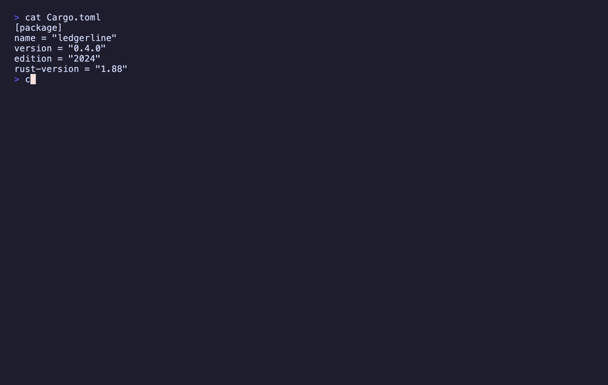

<p align="center">
  
</p>
<h1 align="center">Versions-LE: Two Pins, One Dependency</h1>
<p align="center">
  <b>Find where one dependency is constrained differently across a repository's manifests — and where no version can satisfy both</b><br/>
  <i>package.json · Cargo.toml · pyproject.toml · go.mod · GitHub workflows</i>
</p>

<p align="center">
  <a href="https://marketplace.visualstudio.com/items?itemName=nolindnaidoo.versions-le">
    
  </a>
  <a href="https://open-vsx.org/extension/OffensiveEdge/versions-le">
    
  </a>
  <a href="https://www.npmjs.com/package/versions-le-mcp">
    
  </a>
  <a href="https://crates.io/crates/versions-le">
    
  </a>
  <a href="https://letools.dev/tools/versions-le">
    
  </a>
</p>

---

> **Useful?** A star or rating is how other developers find it —
> [★ GitHub](https://github.com/nolindnaidoo/versions-le) ·
> [★ Open VSX](https://open-vsx.org/extension/OffensiveEdge/versions-le/reviews) ·
> [★ Marketplace](https://marketplace.visualstudio.com/items?itemName=nolindnaidoo.versions-le&ssr=false#review-details)

## What it does

The build broke because `api` asks for `regex = "1"` and `web` asks for `regex = "2"`, and no one version satisfies both. Or it did not break, and will: CI has built on Rust `1.80` since March while `rust-version` says `1.88`.

Press `Ctrl+Alt+V` (`Cmd+Alt+V` on Mac) and every manifest in the workspace is compared as one set — or every manifest under a folder, from the Explorer. The report opens beside the editor: each problem by severity with every file, key and constraint that produced it, then what was deliberately not compared and why. Works in VS Code and in VS Code–based editors like Cursor and VSCodium (installable from Open VSX).

- **In a monorepo** — the crate pinned to `serde 0.9` while the rest moved to `1.0`
- **Before a release** — CI testing on a toolchain older than the minimum you publish
- **Reviewing a dependency bump** — the one package that did not move with the others

**It never edits a manifest, and never guesses**: a constraint it does not model is named and left out of every comparison.

## Install

| Where | What you get | Install |
|---|---|---|
| **VS Code** | The comparison, in your editor, on a keystroke | [Marketplace](https://marketplace.visualstudio.com/items?itemName=nolindnaidoo.versions-le) |
| **Cursor, VSCodium, Windsurf** | The same extension | [Open VSX](https://open-vsx.org/extension/OffensiveEdge/versions-le) |
| **A terminal or a CI step** | A whole tree, with an exit code | `cargo install versions-le` · [crates.io](https://crates.io/crates/versions-le) |
| **Any MCP agent, via Node** | `compare_versions` over stdio | `npx versions-le-mcp` · [npm](https://www.npmjs.com/package/versions-le-mcp) |
| **Zed** | The MCP server as a context server | [add it by hand](https://zed.dev/docs/ai/mcp) *(no listing yet)* |

## The six checks

| Code | Severity | What it means |
|---|---|---|
| `disjoint-constraint` | error | Two constraints for one dependency that **no single version satisfies**. The strongest claim this tool makes. |
| `malformed-constraint` | error | Shaped like a constraint of its own ecosystem, and broken. |
| `constraint-conflict` | warning | One dependency, two or more **different requirements** across sites. |
| `msrv-mismatch` | warning | `rust-version` differs across manifests, or a CI toolchain pin is below the declared minimum. |
| `prerelease-in-production` | warning | An `-rc` or `-alpha` constraint outside dev or build dependencies. |
| `floating-pin` | info | `latest`, `*`, a caret on a `0.x` version, or an unpinned CI tool version. |

**Different and unsatisfiable are two findings.** `constraint-conflict`
is a smell; `disjoint-constraint` is a build that cannot resolve. They
are never conflated.

Disjointness is decided by **interval arithmetic** over the modelled
ranges, not by string comparison — which is also why `>=20` and
`>=20.0.0` are not reported as a conflict. They are one requirement typed
twice.

**One finding per drifted dependency**, carrying every site. A dependency
constrained four ways is one problem with four sites, and four findings
would read as four problems.

## The four refusals

**It never guesses.** A constraint in a grammar this tool does not model
is named in the report's `refusals` and takes part in **no comparison** —
never approximated into a range.

| Reason | When |
|---|---|
| `unknown_grammar` | The value is a constraint in a syntax this tool does not model: PEP 440 `~=`, `!=`, `===`, `==1.2.*`; npm `workspace:`, `npm:`, `file:`, `link:`, a git or https URL, an `owner/repo` shorthand, a dist tag; a Cargo dependency table with no `version`; a commit-SHA or branch action ref; a CI channel name (`stable`, `latest`, `lts/*`). |
| `cross_ecosystem` | The same name appears under two ecosystems. Named once, with a site in each, and **the two are never compared**. |
| `ambiguous_version_string` | A `<tool>-version:` value in a workflow that is not evidently a version — `${{ matrix.node }}`, a list, a filename. No entry is created at all: there is nothing to compare and nothing was invented. |
| `per_job_tool_version` | One CI tool installed at two versions — `python-version: 3.9` in the test job, `3.12` in the publish job. A tool version belongs to the job that installs it, so **the two are never compared**. |

`malformed-constraint` is a **finding**, not a refusal, and the
difference is deliberate: it is the narrower verdict that the value is
shaped like a constraint of its own ecosystem and is broken. The tool
blames the manifest only when it is sure; everything else it blames on
itself. `^^1.0.0` is malformed. `latest` is not — it is a syntax with a
meaning this tool chose not to model.

**Comparison never crosses an ecosystem.** An npm `semver` and a Cargo
`semver` are unrelated packages that share a word — and a bare
`"1.0.200"` means *exactly 1.0.200* in npm and *anything below 2.0.0* in
Cargo. One bridge exists, `msrv-mismatch`, and it is built by naming both
keys rather than by matching a name.

## What it reads

| Manifest | Keys |
|---|---|
| `package.json` | the four dependency sections, `engines.*`, `packageManager` |
| `Cargo.toml` | dependencies, dev, build, the workspace and target variants, `rust-version` |
| `pyproject.toml` | PEP 621 `dependencies`, `optional-dependencies`, `requires-python` |
| `go.mod` | `require` (single and block form), the `go` directive |
| `.github/workflows/*.yml` | `uses:` action refs, `<tool>-version:` inputs, `toolchain:` |

That last row is why this exists as much as the first: a CI toolchain
drifting away from the floor a manifest declares is exactly the failure
nobody notices until a release.

`node_modules`, `vendor` and `.git` are never read. **`.github` always
is** — a workflow lives in a hidden directory by definition.

## What it will not do

- **It never edits a manifest.** No `--fix`, no `--pin`, no `--update`.
  The right version for a drifted dependency is a decision, not a
  derivation.
- **It never resolves a dependency graph.** It reads what the manifests
  *say*, not what a resolver would pick — no lockfiles, no transitive
  analysis.
- **It never hits the network.** It does not know which versions exist,
  which are yanked, or which are newest; only whether two stated
  requirements can be met at once.
- **It does not lint style.** Ordering, quoting and formatting of a
  manifest are somebody else's job.

## Use it from an AI agent

The same engine runs as an [MCP](https://modelcontextprotocol.io) server, so an agent can call it directly instead of diffing manifests by eye.

| Editor | How |
|---|---|
| **VS Code** 1.101+ | Nothing to install — the extension registers `compare_versions` with agent mode |
| **Zed** | No listing yet — [add the MCP server by hand](https://zed.dev/docs/ai/mcp) |
| **Claude Code** | `claude mcp add versions-le -- npx -y versions-le-mcp` |
| **Cursor, Windsurf, anything else** | point it at `npx versions-le-mcp` |

```
compare_versions(files: [{ path, content }], maxResults?)
```

It returns the report the editor renders, as data — findings capped at 500 by default with `meta.truncated`. It reads no files and makes no network requests. Published as [`versions-le-mcp`](https://www.npmjs.com/package/versions-le-mcp) on npm and as `io.github.nolindnaidoo/versions-le` in the [MCP registry](https://registry.modelcontextprotocol.io). It answers exactly as the Rust CLI's server does: one corpus runs against both, and a differential test feeds both thousands of generated manifest sets — broken JSON and TOML included — and compares every answer.

<details>
<summary><b>Configuring it by hand</b> — any host with an MCP config file</summary>

```json
{
  "mcpServers": {
    "versions-le": {
      "command": "npx",
      "args": ["-y", "versions-le-mcp"]
    }
  }
}
```

Or install it once with `npm install -g versions-le-mcp` and point at `versions-le-mcp`. It needs no environment variables, no API key and no configuration of its own. To check it:

```bash
echo '{"jsonrpc":"2.0","id":1,"method":"tools/list"}' | npx -y versions-le-mcp
```

</details>

## The CLI

The same comparison runs over a tree from a terminal or a CI step: a Rust CLI in [`crate/`](crate/README.md), sharing one corpus with the extension — [`crate/fixtures/`](crate/fixtures/) — so the two can never read a constraint differently.

<p align="center">
  
</p>

```bash
versions-le .                          # every manifest in the tree, as one JSON report
versions-le --ecosystem cargo .        # one ecosystem
versions-le --fail-on any .            # floating pins fail the build too
versions-le --strict .                 # an unanalysed corner exits 2
versions-le mcp                        # compare_versions and versions_le_check over MCP on stdio
```

**The exit code is the product** — 0 nothing above `info`, 1 findings, 2 the question was malformed. No manifests at all is 0: nothing can conflict with nothing.

## Commands

| Command | Description |
|---|---|
| `Versions-LE: Compare Versions` (`Ctrl+Alt+V` / `Cmd+Alt+V`) | Compare every manifest in the workspace, or under the folder picked in the Explorer |
| `Versions-LE: Open Settings` | Open Versions-LE settings |
| `Versions-LE: Help & Troubleshooting` | Built-in documentation |

## Settings

| Setting | Default | Description |
|---|---|---|
| `versions-le.exclude` | `[]` | Glob patterns for manifests to leave out; `node_modules`, `.git` and `vendor` are always left out |
| `versions-le.openResultsSideBySide` | `true` | Open the report beside the current editor |
| `versions-le.copyToClipboardEnabled` | `false` | Also copy the report to the clipboard |
| `versions-le.notificationsLevel` | `silent` | `all` = every notification, `important` = warnings + errors, `silent` = errors only |
| `versions-le.statusBar.enabled` | `true` | Show the status bar item |
| `versions-le.telemetryEnabled` | `false` | Local-only event log (see Privacy) |

## Languages

Twelve languages besides English:

German · Spanish · French · Indonesian · Italian · Japanese · Korean ·
Portuguese (Brazil) · Russian · Ukrainian · Vietnamese · Chinese (Simplified)

Both halves are covered — the manifest (command titles, setting names and descriptions) and everything shown while the extension runs (notifications, the status bar and the report's headings). A finding's message is the engine's English, identical to the CLI's.

## Privacy & security

- **No network access.** The extension never sends data anywhere; it does not know which versions exist, only whether two stated requirements can be met at once. The `telemetryEnabled` setting only writes events to a local Output Channel you can inspect (`Versions-LE`).
- **It reads manifests and nothing else**, and never writes to one.
- **The MCP server holds the same line.** It takes content as an argument and returns data: no filesystem access, no network calls, no telemetry.
- Error notifications redact home directories and credential-shaped fragments.

## Documentation

| What | Where |
|---|---|
| What the tool is allowed to say — checks, refusals, the output contract, non-goals | [`crate/SPEC.md`](crate/SPEC.md) |
| How the extension is built and held together — architecture, invariants, toolchain, release | [AGENTS.md](AGENTS.md) |
| How the CLI is built and held together | [`crate/AGENTS.md`](crate/AGENTS.md) |
| What changed | [CHANGELOG.md](CHANGELOG.md) · [`crate/CHANGELOG.md`](crate/CHANGELOG.md) |
| The tool's page, and the other fifteen | [letools.dev/tools/versions-le](https://letools.dev/tools/versions-le) |

## Performance

<!-- performance:start -->
| Input | Size | Found | Time | Rate | Scan speed |
| --- | --- | --- | --- | --- | --- |
| 50 crates, 50 packages | 0.01 MB | 450 | 2.37 ms | 189,660/sec | 6.1 MB/s |
| 500 crates, 500 packages | 0.15 MB | 4,500 | 19.25 ms | 233,818/sec | 7.6 MB/s |
| 2,000 crates, 2,000 packages | 0.58 MB | 18,000 | 197.84 ms | 90,983/sec | 3 MB/s |

Median of 7 runs after warmup, on Apple M5 Pro, 24 GB RAM, Node 24.3.0. Inputs are generated
by `scripts/benchmark.ts` rather than checked in, so the sizes above are
exactly what was measured. Reproduce with `bun run benchmark`.

These are machine-specific and are not asserted in CI — a benchmark that gates
a build only tells you how busy the runner was.
<!-- performance:end -->

## Testing

<!-- coverage:start -->
| Metric | Coverage |
| --- | --- |
| Statements | 86.91% |
| Branches | 79.62% |
| Functions | 94.44% |
| Lines | 90.66% |

265 test cases across 13 files, plus an integration suite that runs
in a real VS Code extension host and an end-to-end test that installs the
built `.vsix` into a clean profile.

Generated from a real run — `coverage/coverage-summary.json` and
`coverage/test-results.json` — by `scripts/coverage-readme.js`; CI fails if
this section drifts. Reproduce with `bun run test:coverage`, and the case
count is the one vitest prints.
<!-- coverage:end -->

## More from the LE family

Sixteen single-purpose tools for the work in front of every model. Each ships
a Rust CLI and an MCP server. One page: **[letools.dev](https://letools.dev)**

**Get it out**

- **[String-LE](https://letools.dev/tools/string-le)** — Extract every string in a codebase, with its position, so a person can read them
- **[Numbers-LE](https://letools.dev/tools/numbers-le)** — Extract every hardcoded number in a codebase, so a person can check them
- **[Units-LE](https://letools.dev/tools/units-le)** — Extract every quantity with its unit, normalized, and refuse the ambiguous ones by name
- **[Dates-LE](https://letools.dev/tools/dates-le)** — Extract every date and timestamp, and the exact instant each one resolves to
- **[IDs-LE](https://letools.dev/tools/ids-le)** — Extract every UUID, ULID, NanoID, ObjectId and Snowflake, and decode the time inside
- **[IPs-LE](https://letools.dev/tools/ips-le)** — Extract every IP address, CIDR block and MAC, normalized and classified by scope
- **[URLs-LE](https://letools.dev/tools/urls-le)** — Extract every URL in a codebase, with its protocol and exact position
- **[Paths-LE](https://letools.dev/tools/paths-le)** — Extract every file path in a codebase, and say whether it still points at anything
- **[Colors-LE](https://letools.dev/tools/colors-le)** — Extract every color in a codebase, and say which ones are not in your palette

**Check it**

- **[Regex-LE](https://letools.dev/tools/regex-le)** — Find every regex in a codebase, and report which can be driven into catastrophic backtracking
- **[Versions-LE](https://letools.dev/tools/versions-le)** — Find where one dependency is constrained differently across a repository's manifests
- **[i18n-LE](https://letools.dev/tools/i18n-le)** — Identify the i18n library a project uses, then audit its catalogs by that library's rules
- **[Scrape-LE](https://letools.dev/tools/scrape-le)** — Check whether a page is scrapeable before the scraper is written, and say when it cannot tell

**Guard it**

- **[Secrets-LE](https://letools.dev/tools/secrets-le)** — Find hardcoded credentials in a codebase, and never print one into the report
- **[EnvSync-LE](https://letools.dev/tools/envsync-le)** — Compare the dotenv files in a tree, and say which keys are missing from which
- **[Unicode-LE](https://letools.dev/tools/unicode-le)** — Find the Unicode that hides meaning — bidi controls, invisibles, homoglyphs, mixed scripts

Each stands on its own: no shared crate, no published core. Where two of them
agree, it is because the same answer was right twice.

**Contact** — [nolindnaidoo.com](https://nolindnaidoo.com) · [GitHub](https://github.com/nolindnaidoo) · [LinkedIn](https://www.linkedin.com/in/nolindnaidoo/)

## Also by nolindnaidoo

**Rust** — pixelcoords and pixelactions are one loop: pixelcoords answers
*where*, pixelactions *acts* there. Their own tools, their own voice — not
part of the LE family.

- **[pixelcoords](https://github.com/nolindnaidoo/pixelcoords)** — Freeze your screen, mark regions, get pixel-exact coordinates and crops
  [pixelcoords.dev](https://pixelcoords.dev) · [crates.io](https://crates.io/crates/pixelcoords) · [docs.rs](https://docs.rs/pixelcoords)
- **[pixelactions](https://github.com/nolindnaidoo/pixelactions)** — Consume human-verified coordinates, perform the interaction, confirm it landed
  [pixelactions.dev](https://pixelactions.dev) · [crates.io](https://crates.io/crates/pixelactions) · [docs.rs](https://docs.rs/pixelactions)

## License

MIT © [nolindnaidoo](https://github.com/nolindnaidoo)
